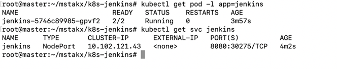
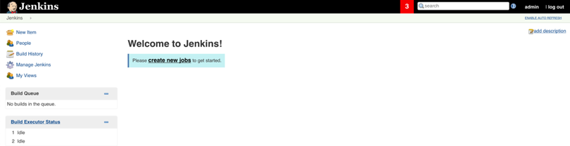
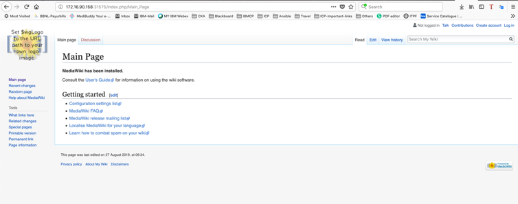
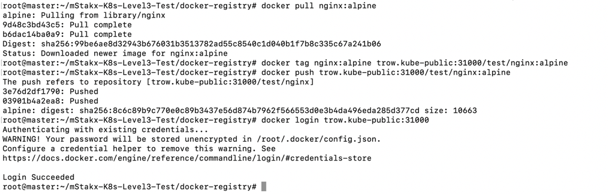
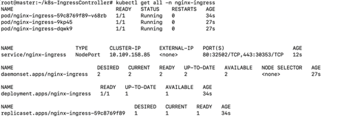
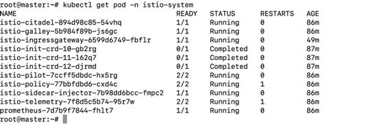
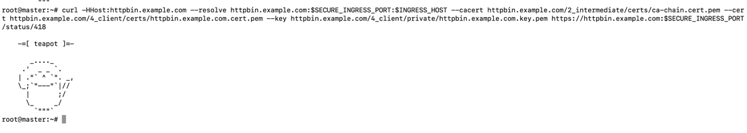
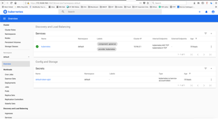

# mStakx-K8s-Level3-Test

Tasks:
1.	If you are attempting this test, then kindly look at the Level#2 test instructions as well as it is referenced below. 

Solution:
Please refer.[Install K8s Cluster](https://github.com/senthil2kumars/K8s-mStakx-Level2-Test)

2.	Create a Kubernetes cluster on GCP (GCP gives free credits on signup so those should suffice for this exercise) on their virtual machines (do not use GKE) or use the cluster created in the level2 test. If possible share a script / code which can be used to create the cluster. 

Solution:
I have setup the Highly Available clusters with kubeadm. [Install K8s Cluster](https://github.com/senthil2kumars/K8s-mStakx-Level2-Test/tree/master/k8s-install-Prerequisites)
Please refer.[Install K8s Cluster](https://github.com/senthil2kumars/K8s-mStakx-Level2-Test)

3.	Setup CI Server (Jenkins or tool of your choice) inside the Kubernetes cluster and maintain the high availability of the jobs created.
 
 Solution:
 I have deployed jenkins on the kubernetes server.
 The Jenkins dashboard :

 Please refer https://github.com/senthil2kumars/K8s-mStakx-Level2-Test for Jenkins jobs.

4.	Create a namespace and deploy the mediawiki application (or any other application which you think is more suitable to showcase your ability, kindly justify why you have chosen a different application) on the cluster. 

Solution:
Create Helm chart for Mediawiki and deployed via Jenkins .
The Mediawiki dashboard.

5.	Setup a private docker registry to store the docker images. Configure restricted access between cluster to registry and Cluster to pipeline.

Solution:
Configured private docker registry with restricted access.

 
6.	Deploy an open source vulnerability scanner for docker images scanning within the CI build pipeline.

Solution:
Please refer.[Install K8s Cluster](https://github.com/senthil2kumars/K8s-mStakx-Level2-Test) - 6th task.

7.	Setup Nginx Ingress Controller manually. Configure proper routes between ingress and the application.

Solution:
Please refer.[Install K8s Cluster](https://github.com/senthil2kumars/K8s-mStakx-Level2-Test) for installation steps.

8.	Setup Istio and configure Kiali & Zipkin.

Solution:
Installed Istio and configured Kiali and Zipkin.

 
9.	Setup mTLS authentication between microservices. Use self-signed certificates for secure communication between microservices.

Solution:
Installed Istio and configured Kiali and Zipkin. Configured mTLS authentication between microservices for sample applicaiton.

 
10.	Setup Kubernetes Dashboard and secure access to the dashboard using a read only token

Solution:
Installed Kubernetes and configured Dashboard for secure access.
Please refer.[Install K8s Cluster](https://github.com/senthil2kumars/ks8-mstakx-Level1-test) for installation steps.

